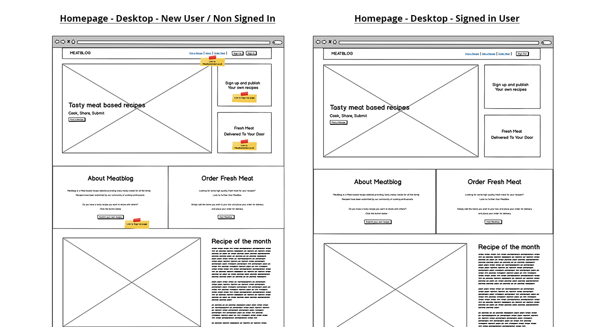
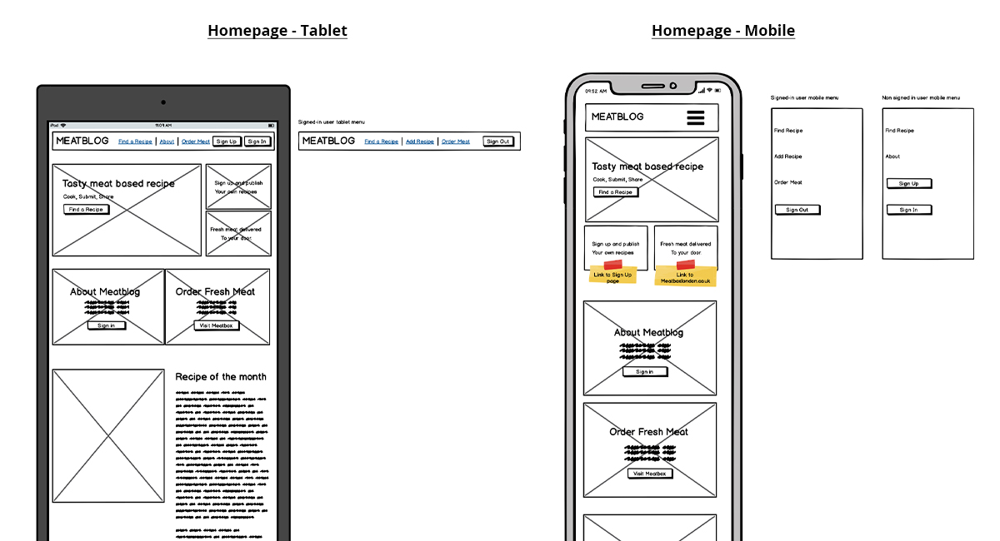

# Milestone 3 Project - Meatblog

Meatblog has been built using my learnings and knowledge of all the Code Academy Full Stack Developer Course modules learnt so far. This includes HTML, CSS, JavaScript, Python, Flask and MongoDB.

The website is a fully responsive, custom-built website which has been designed and built with the users wants and needs first, whilst maintaining high design standards.

You can view the live website here: [Meatblog](https://meatblog.herokuapp.com/)

The purpose of the website is to provide an online, Meat-based recipe blog which has been and continues to be compiled by a community of users, in addition to the site owner.

The owner wanted to create this website to support and increase traffic to their other business, Meatbox, a fresh meat delivery company.

Recipes will be visible to non-registered users, but users must register to be able to post and edit their own recipes.

Meatblog was a site idea I previously had a go at designing and building some years ago, but due to my lack of knowledge at the time, it was never what I wanted it to be and did not stay live for very long. It was template design-based and had no interactive features, database or user submission functionality. I thought this project would be the perfect time to bring the site idea back to life, and properly this time.

You can view the live website here: [Meatblog](https://meatblog.herokuapp.com/)

## UX
The site owner is a fan of cooking and cooking meat-based dishes. As a contrast to the many meat-free/vegan websites which has become popular in recent years, they wish to create a recipe website based solely on meat dishes.

The website providees some recipes from the site owner for others to share and follow, but also encourage other users to create a free account and share recipes of their own.

The website makes adding, editing and deleting recipes easy and straightforward for external users, with the ability to share recipes to social channels.

## New External User Goals:
* As a new user, I want to be able to view recipes to cook
* As a new user, I want to be able to register for the website and post my own recipes

## Frequent User Goals:
* As a frequent user, I want to be able to share my own recipes to the website and with the community in an easy way
* As a frequent user, I want to be find new recipes to cook
* As a frequent user, I want to be able to share recipes that I like to my social network pages

## Returning External User Goals:
* As a returning user, I want to be able to edit/update my posted recipes
* As a returning user, I want to be able to delete my posted recipes

## Site Owner User Goals:
* As the site owner, I want to share my meat-based recipes
* As the site owner, I want to drive traffic from this site to upsell from the fresh meat delivery business.

## Wireframes
Using the user stories above, I put together the wireframes for Meatblog using [Balsamiq](https://balsamiq.com/). The wireframes covered desktop, tablet and mobile formats. 

Due to the navigation items changing depending on whether a user is signed in or not, a number of additional wireframes were needed to be created to show the difference. For example, when a user is not signed in to the site, they cannot view the ‘Add Recipe’ page and can see buttons in the main navigation for ‘Sign Up’ and ‘Sign In.’ 

When a user has registered/signed into the site, these buttons are hidden and ‘Sign Out’ becomes visible, as does ‘Add a Recipe.

[You can view all of the wireframes here](static/readme_docs/wireframes.pdf)

Below are is the homepage wireframes for desktop, mobile and tablet, with both navigation views for a signed in user, and a non signed in/new user.

## Changes to wireframes:
Whilst I was in the process of building the website, I decided to make a few small amends to my initial wireframes.

Removal of Delete button from Find Recipe page: I decided to only have the ‘delete recipe’ button within the ‘Edit Recipe’ page rather than the Find a Recipe page also. I felt that there were too many buttons on the ‘Find a Recipe’ page and I did not want to confuse users or take away from the main part of the page – viewing the recipes themselves. Removing the Delete button from this section made the page much cleaner and improved usability of the page.

Added image on Find a Recipe page: I decided to add an image to each recipe on the ‘Find a Recipe’ page. I felt that being a recipe website, the visual cue for each recipe would be important in the section. I feel that the overall result is a huge improvement and make the page much more visually appealing, as well as making recipes easier to find.

Adding form helpers: I decided to add form helper information to the following pages: ‘Sign up’, ‘Add Recipe’ and ‘Edit Recipe.’ Initially, the helpers were to provide the user-specific instructions on how to upload a recipe to the website so that it would be formatted correctly (each item must be on a new line) and to explain to a user what is expected to upload an image. Another reason I decided to add helpers was due to my mentor testing the website and not being able to sign up. I decided that I should make it clear what would be accepted as a username, password etc. (A-Z, numbers but not special characters).

## Scope
* Users can find meat based recipes to cook themselves
* Users can sign up to the website
* User can submit their own recipes to the website
* Users can edit and delete their recipes from the website
* Users can click through to order fresh meat to make their recipes

## Existing Website Features
**Navigation Bar:** the navigation bar allows users to navigate to the relevant sections on the website, including sign in/sign up/sign out, add own recipes, find a recipe and the external link to the fresh meat delivery company. 
**Sign up:** The sign up sections allows users to register for the website so they can upload and edit/delete their own recipes. In the sign up section, users fill out a simple form for a username and password which they then use each time they need to sign in.
**Sign in:** Users can sign into their accounts by using the simple username and password form and the details which they created their account with. Once signed in, users can add, edit and delete their recipes, as well as search for recipes by other users.
**Delete button:** Signed in users will be able to delete their own posted recipes by clicking on the delete button in the Edit Recipe page. They will not be able to delete recipes posted by other users. I have also included some defensive programming using a pop up modal, asking the user to confirm they want to delete their recipe. This will stop recipes being deleted by accident.
**Edit Recipe button:** Signed in users will be able to edit their own posted recipes by clicking on the edit button. They will not be able to edit recipes posted by other users. 
**Social sharing buttons:** Users will be able to share recipes they like to their social media channels via the social sharing buttons provided. Users will be able to share any recipe, even if they did not post the recipe.
**Order recipes by date added to see new ones first:** The Find a Recipe page is organised by newest posted recipe first/at the top. This will make it easier for new and returning visitors to view the latest recipes.
**The ability for a user to upload a photo to go with their recipe:** Users can add images to their posted recipe via the Add Recipe and Edit Recipe form by including a URL to the image.
**Flash messages:** Flash messages will appear on the website at the top of the page, under the main navigation. These appear for successful and non-successful registration, successful sign in and out, successfully updated and added recipes.

### Features to add in the future
There are several features I would like to add to the website in the future. I am not at the skill level to include these now, but would like to come back to them to do so.
**Save/favourite recipes:** Signed in users would have the ability to save their favourite recipes so they can easily come back to them in the future, and time and time again.
**Send recipe to site owner for approval before posting:** This would eliminate spam postings and also low quality or inappropriate posts. For now, these need to be manually looked over frequently.
**Search or filter functionality:** There would hopefully come a time when the website has so many recipes they need to be whittled down. I would like to add a filter function which could include specific ingredients, or a search function for the same.

## Schema design

## Technologies Used
I used a number of languages, frameworks and tools to construct my website. These include;

* [HTML](https://html.com/)
* [CSS](https://www.w3.org/Style/CSS/Overview.en.html) 
* [JavaScript](https://www.javascript.com/) 
* [JavaQuery](https://jquery.com/)
* [Python](https://www.python.org/)
* [Flask](https://flask.palletsprojects.com/en/1.1.x/)
* [Materialize](https://materializecss.com/)
* [GitHub](https://github.com/)
* [GitPod](https://www.gitpod.io/)
* [MongoDB](https://www.mongodb.com/)
* [Heroku](https://www.heroku.com/)
* [ShareThis](https://sharethis.com/)
* [Font Awesome](https://fontawesome.com/)

## Tools Used
* [Balsamiq](https://balsamiq.com/) - Used to create my wireframes, showing the positioning of elements on varying screen sizes.
* [Adobe Photoshop](https://www.adobe.com/uk/products/photoshop.html) - Photoshop was used to create the website logo.
* [W3C HTML Validator](https://validator.w3.org/) - I used this tool to check the validity of my HTML code.
* [W3C CSS Validator](https://jigsaw.w3.org/css-validator/) - I used this tool to check the validity of my CSS code.
* [Autoprefixed](https://autoprefixer.github.io/) - I used this tool to check the prefixes of my CSS code.
* [PEP8](http://pep8online.com/) - I used this tool to check that my app.py file meets the PEP8 requirements.

## Testing

**PEP8 Compliance**
I used the website [PEP8](http://pep8online.com/) to check my app.py files complied with the PEP8 requirements. 

1st test of code: 2 Errors occurred:
* Line 2: line too long
    * I corrected this error by adding a backslash part way through the line and moving part of the text to the line below, making sure to add the correct indentation.

* Line 136: line too long
    * I corrected this error by splitting up the long line of text across a further two lines making sure to add the correct indentation.

2nd test: passed with no errors

**W3C CSS Validator**
I used the [W3C CSS Validator](https://jigsaw.w3.org/css-validator/) to check the validity of my CSS code.
* 1st test: Passed with no errors.

**W3C HTML Validator**
I used the W3C HTML Validator (https://validator.w3.org) to check the validity of my HTML code on all 8 pages.

* Index.html
    * Passed with no errors
* Add_recipe.html
    * Passed with no errors
* Edit_recipe.html
    * Error: Bad value for attribute value on element input: Line feed not allowed - I believe this error is being displayed due to the Edit Recipe page being pre-filled with content in order to edit it. The value being pulled into the value attribute comes from the recipe database which is then formatted to display on the view_recipe page with splitlines. When I paste the html code directly into the validator, this error does not appear.
* Recipes.html (Find a Recipe page)
    * Passed with no errors
* Sign_in.html
    * Passed with no errors
* Sign_up.html
    * Passed with no errors
* View_recipe.html
    * Passed with no errors

## User Stories Testing:
**New External User Goals:**
*As a new user, I want to be able to view recipes to cook*
* There are 2 prompts/CTA’s to direct a new (and also returning) user to view all the website recipes so they can find one to cook. The first and main CTA is in the navigation header under ‘Find a Recipe.’ This link is visible to all new visitors, as well as signed in visitors, so it will always be there. Additionally, there is a Find a Recipe button in the main homepage image

*As a new user, I want to be able to register for the website and post my own recipes*
* Thanks to 3 ‘Sign Up’ buttons on the homepage (in the main navigation, in the About section and in the large ‘Submit Your Own Recipe’ bar), directing a user to the sign up function is very clear. As well as these buttons, there is an image at the top of the homepage which also states a user can sign up to post their own recipes.
* With the Sign Up button in the main navigation, the user will be able to click on this button no matter there they are currently on the site.
* There is also a link to ‘Sign Up’ from the ‘Sign In’ page should the user end up on this page instead.

**Frequent User Goals:**
*As a frequent user, I want to be able to share my own recipes to the website and with the community in an easy way*
* Once logged in via one of the many options above, an ‘Add Recipe’ item will appear in the main navigation. The Add Recipe page is a simple form-based page which the user can fill out to be able to add their own recipes.
* The form also includes some additional instructions for the user to follow when uploading their recipes to assist them with the process.

*As a frequent user, I want to be find new recipes to cook*
* Recipes on the ‘Find a Recipe’ page have been organised to display the newest recipes first, making it easy for a returning visitor to be able to view new recipes, rather than need to look for them.

*As a frequent user, I want to be able to share recipes that I like to my social network pages*
* Social share buttons have been added to the View Recipe page. This allows the website user to share that particular recipe to social pages, as well as share a link in an email.

**Returning External User Goals:**
*As a returning user, I want to be able to edit/update my posted recipes*
* Users can edit their own recipes easily. Once on the ‘Find a Recipe’ page, the user will be able to see an ‘Edit Recipe’ button to the right, beneath the ‘View Recipe’ button. This will take them to a full Edit Recipe page which looks very similar to the Add Recipe page. Users can replace the information in the form, then click update to update the recipe, or cancel should they change their mind.
* Users will only be able to see an ‘Edit Recipe’ button once they are logged and it will only be displayed on for recipes they added to the website from their account.

*As a returning user, I want to be able to delete my posted recipes*
* Within the Edit Recipe page there is a large button at the bottom ‘Delete Recipe.’
* Once clicked, the recipe will not immediately delete, instead a modal will pop up to ask the user to confirm that do in fact want to delete their recipe. Upon agreeing, the recipe is removed from the website, as well as the database.

**Site Owner:**
*As the site owner, I want to share my meat-based recipes*
* The website owner is able to post, edit and delete their own recipes in the same way that external users are able to do so.

*As the site owner, I want to drive traffic from this site to upsell from the fresh meat delivery business.*
* The navigation includes a button to ‘Order Meat’. Once clicked, the user will be taken, via a new tab, to the fresh meat delivery company MeatBox. 
* Additionally, there are 2 further CTA’s to show the user of the site where they can order fresh meat – in the main images at the top of the page, and in the about section.
* Thanks to the website being a meat based blog, links to an external meat delivery service fit in to the theme perfectly.

View the full testing document here: (static/readme_docs/testing.pdf)

## Deployment

### Deploying Website To Heroku
1. In the terminal, I created a requirements.txt and Procfile using the following commands:
    1. pip3 freeze –local > requirements.txt
    1. echo web: python app.py > Procfile (be sure to create this file with a capital P)
1. Commit the new files to GitHub
1. Within my Heroku.com account I create a new App called metablog and chose the region closes to me, Europe.
1. Within the deploy sections which opened automatically after creating the app, I selected the Deployment Method of Connecting to GitHub via the logo. 
1. Beneath this I typed the GitHub repository name metablog and hit search. When the correct repository was found I clicked the ‘connect’ button.
1. Next, I clicked on ‘Settings’, then in Config Vars, I clicked ‘Reveal config Vars’. I willed out the Config Vars with the following information:

Config Vars | Config Vars
------------ | -------------
IP | 0.0.0.0
PORT | 5000
SECRET_KEY | (hidden)
MONGO_URI | (hidden)
MONGO_DBNAME | meatblog

1. In Deploy, I clicked ‘Enable Automatic Deploys’ and deployed from the Master branch.
1.	Follow this I then clicked ‘Deploy Branch’ and the app was deployed successfully at the URL metablog.herokuapp.com

### To create a clone of the Meatblog repository and run locally
Cloning the repository makes a copy of the of the repository which you download and store on your machine locally.

To make a clone of Meatblog, follow the following steps:
1. Visit the main repository of Meatblog [here:](https://github.com/michellelclement/meatblog)
1. Above all the repository files and folders, you will find two Green buttons. Click on the one displaying ‘Clone’ with a downward arrow and a download icon.
1. With the ‘HTTPS’ method selected, click the ‘copy’ button next to the URL. Here you will find the link you will need to copy. The link to copy Meatblog is: https://github.com/michellelclement/meatblog.git 
1. Open the working directory where you want the repository to be cloned to, and in the terminal use the command and hit enter: 
        git clone https://github.com/michellelclement/meatblog.git 
1. All the files will now be cloned into your chosen workspace.

## Design

**Colours**
I wanted to keep the colour pallet simple with minimal colours, just using one main colour plus white, greys and black. As I was using Materialize, I chose to go with their ‘red lighten range’ as I liked how each colour looked on its own, and it gave me the flexibility to use different ‘lighten’ values for highlighting different content and colouring buttons. The colour is called red; however, the lighter values were more of a pink/salmon colour, which I really liked.

The main colours I used for the website where the following:
* Main pink colour: #fb9496 (Materialize red lighten-3)
* Darker Pink: # a94b4e (Materialize red lighten-2)
* Darkest Pink: Cancel buttons: #ef5350 (Materialize red lighten-1)
Off white: View recipe button: #ffebee Red lighten-5

Additionally, I used the following grey colours:
* Dark grey: #bdbdbd Grey lighten-1
* Light grey: #e0e0e0 Grey lighten-2

**Fonts**
Both fonts I chose were from Google fonts.
Playfair Display: I liked this font as it is a little more traditional in a modern way. It is clear to read and pairs nicely with the foodie theme of the website.
Sans Serif: I wanted to keep the body copy of the website clear, modern and easy to ready, and Sans Serif is not only the perfect font for this, but it pairs beautifully with Playfair. 

## Credits
**Social Sharing buttons:** To add simple and stylish share buttons to the website I used the plugin by: Sharethis.com 

**Images:** All homepage images are my own. Images used within recipe submissions have been submitted via me and testers using URL links to external sources.

**Logo:** Designed by myself when I first initially had the idea for Meatblog.

**Recipes:** All recipes added by users michellec and admin are my own personal recipes. Additional recipes have been added by testers of the site.

**Mockups**
3 x Apple product mockup – Free download via MockupWorld](ttps://www.mockupworld.co/)

## Acknowledgements

Special Thank you to my fantastic mentor ADEGBENGA ADEYE for helping me with my ideas and directing me on how to fix errors and bugs.

Thank you to Slack members and Pauld0051for testing out the website and highlighting a display issue on his mobile, and Ivan Branimir Skoric for his help in directing me to the answers I needed for internal page linking.

I would also like to extend my thanks to the Tutors who helped me solve many of my bugs. These include Stephen Moody, Cormac Lawlor and Johann Alberts. 
